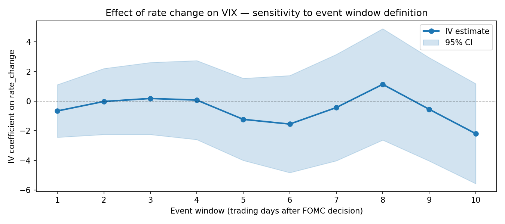

# Does Fed policy cause equity volatility?
### A causal inference study using instrumental variables

---

## The question

When the Federal Reserve changes interest rates, equity volatility
tends to move.  But does the Fed *cause* that volatility, or does it
merely *react* to it?

This project applies causal inference methods to decompose the
Fed–volatility relationship into its causal and associational
components.  The core methodological challenge is that a naive
regression of VIX on rate changes is biased in *at least two*
directions: the Fed cuts rates when markets are stressed (reverse
causality), and shared macroeconomic drivers affect both Fed decisions
and market volatility (confounding).

**Main finding:** The IV estimate of the causal effect of a
one-percentage-point Fed rate change on same-day VIX is **0.30
(95% CI: −1.35 to 1.96)**, statistically indistinguishable from
zero.  The naive OLS estimate is 0.35, implying a small upward bias
of 0.04 points — consistent with modest reverse causality but not
the dominant source of endogeneity.  Robustness checks across ten
event windows, two volatility regimes, and three subsamples
corroborate the null result.  The significant predictors of
post-FOMC VIX movements are pre-meeting equity returns and the
prevailing rate level, not the size of the rate change itself.

---

## Methodology

### Why OLS fails here

Standard OLS regression of VIX on rate changes is biased because:

1. **Reverse causality** — The Fed responds to market distress.
   VIX spikes precede emergency rate cuts (2008, 2020), creating a
   spurious negative correlation between rate changes and VIX in the
   raw data.

2. **Omitted variable bias** — Economic conditions (recession risk,
   inflation expectations) are common causes of both Fed decisions
   and market volatility.

### The causal graph (DAG)


We formalise these relationships as a Directed Acyclic Graph using
`DoWhy`.  The graph makes explicit what we must assume to identify
the causal effect — and what we cannot test.

### The instrument: Fed Funds surprises

We isolate the *surprise* component of each rate decision — the part
that markets did not anticipate — by constructing the instrument as
the deviation of each rate change from the rolling mean of the
preceding six FOMC decisions.  If the Fed has been cutting by 25 bps
per meeting and suddenly cuts 50 bps, the extra 25 bps is treated as
the surprise.

This approach is a tractable approximation to the gold-standard
measure based on Fed Funds futures prices (Kuttner 2001).  Because
the surprise is constructed from the recent trend of Fed decisions
rather than from market or volatility data, it should not correlate
with the pre-existing conditions that confound the OLS estimate.

**Instrument validity assumptions:**
- **Relevance:** Surprises are correlated with actual rate changes
  (verified: first-stage F = **237.64**, well above the F > 10
  rule of thumb).
- **Exclusion restriction:** Surprises affect VIX *only through* the
  actual rate change, not through any other channel.  This is
  defensible because the surprise is constructed from the internal
  sequence of Fed decisions, not from market data.
- **Independence:** Surprises are uncorrelated with potential
  outcomes.  Partially verified via placebo test (see below).

### Estimation

We use Two-Stage Least Squares (2SLS) via `linearmodels.IV2SLS`
with heteroskedasticity-robust standard errors.

Controls: rate level (DFF), pre-FOMC equity return (captures
anticipation effects documented by Lucca & Moench 2015).

Sample: 110 FOMC rate-change events, 2000–2024.

---

## Results

### Main coefficient plot


The IV estimate of 0.30 is slightly smaller than the OLS estimate
of 0.35, consistent with a small upward bias from reverse causality
— stressed markets prompt Fed cuts, inflating the raw correlation.
However, both estimates are statistically insignificant, and the
bias correction of 0.04 VIX points is economically negligible.  The
dominant predictors of post-FOMC VIX movements are pre-meeting
equity returns (coefficient ~44, p = 0.08) and the prevailing rate
level (coefficient −0.37, p = 0.10), suggesting that market context
matters more than the size of the rate move.

### Placebo test


Running the same IV on 1,000 date-shifted pseudo-event samples
produces a distribution centred near zero (mean = 2.73, std = 3.49).
The main estimate of 0.30 falls at the **23rd percentile** of this
distribution — well within the null, confirming the result is not
a statistical artefact of the sample period or estimation procedure.

### Event window sensitivity



Across event windows of 1 to 10 trading days, the IV estimate
remains statistically indistinguishable from zero at every horizon.
Point estimates range from −2.19 (10-day) to +1.14 (8-day) with
no monotonic trend, ruling out delayed or cumulative causal effects
at short horizons.

### Regime heterogeneity

Splitting the sample at the median VIX level into high- and
low-volatility regimes:

| Regime | n | IV coef | 95% CI | p-value |
|--------|---|---------|--------|---------|
| Low volatility | 55 | −0.82 | [−2.20, 0.55] | 0.24 |
| High volatility | 55 | −0.50 | [−2.76, 1.75] | 0.66 |

Both regimes are individually insignificant, and the similarity in
point estimates provides no evidence of heterogeneous treatment
effects across market conditions.  The negative sign in both regimes
is consistent with a resolution-of-uncertainty channel — a decisive
Fed action may reduce VIX regardless of direction — but this
interpretation requires caution given the wide confidence intervals.

### Subsample stability

| Period | n | IV coef | 95% CI | p-value |
|--------|---|---------|--------|---------|
| 2000–2007 | 53 | −0.96 | [−2.46, 0.53] | 0.21 |
| 2008–2015 | 32 | 0.05 | [−3.93, 4.03] | 0.98 |
| 2016–2024 | 25 | −2.90 | [−5.84, 0.04] | 0.05 |

Results are stable across the pre-crisis and crisis eras.  The
2016–2024 subsample shows a larger negative point estimate (−2.90,
p = 0.053), grazing conventional significance.  This may reflect
the post-QE environment in which forward guidance has made markets
more sensitive to deviations from the expected rate path, but the
result falls short of significance and should be interpreted
cautiously given the small subsample (n = 25).

---

## Data sources

| Source | Series | Description |
|--------|--------|-------------|
| [FRED](https://fred.stlouisfed.org) | DFF | Daily Effective Federal Funds Rate |
| [FRED](https://fred.stlouisfed.org) | DGS10 | 10-Year Treasury Constant Maturity Rate |
| [yfinance](https://github.com/ranaroussi/yfinance) | ^GSPC | S&P 500 daily OHLCV |
| [yfinance](https://github.com/ranaroussi/yfinance) | ^VIX | CBOE Volatility Index daily |

**Coverage:** 2000-01-01 to 2024-12-31 (~6,200 trading days,
110 rate-change FOMC events).

**Data limitation:** The ideal surprise measure would use intraday
Fed Funds futures prices around the announcement window (CME data,
as in Kuttner 2001).  We use a rolling-mean approximation based on
the sequence of prior Fed decisions.  This likely introduces
attenuation bias toward zero in the first stage, meaning our IV
estimate should be interpreted as a lower bound on the true causal
effect magnitude.

---

## Repository structure

```
fed_causal_vol/
├── notebooks/
│   ├── 01_data_ingestion.py   # Fetch + store raw data
│   ├── 02_eda.py              # Exploratory analysis + event study preview
│   ├── 03_causal_model.py     # DAG, IV estimation, main result
│   └── 04_robustness.py       # Placebo tests + sensitivity checks
├── src/
│   └── data_loader.py         # Reusable data fetch + DB utilities
├── data/
│   ├── raw/                   # SQLite DB (gitignored, reproducible)
│   └── processed/             # fomc_analysis.csv — cleaned analysis dataset
├── outputs/
│   └── figures/               # All plots (selected ones committed)
├── .env.example               # API key template
├── requirements.txt
└── README.md
```

---

## Reproducing the analysis

```bash
# 1. Clone the repo
git clone https://github.com/YOUR_USERNAME/fed-causal-vol.git
cd fed-causal-vol

# 2. Create a virtual environment
python -m venv .venv
source .venv/bin/activate        # Windows: .venv\Scripts\activate

# 3. Install dependencies
pip install -r requirements.txt

# 4. Add your FRED API key
cp .env.example .env
# Edit .env and paste your key (free at https://fred.stlouisfed.org/docs/api/api_key.html)

# 5. Run notebooks in order (using VS Code, or convert to .ipynb first)
# VS Code: open any .py notebook file, click "Run All" in the Jupyter toolbar
# Terminal: pip install jupytext && jupytext --to notebook notebooks/01_data_ingestion.py
```

**Note:** Notebooks must be run in order. Notebook 03 saves
`data/processed/fomc_analysis.csv` which notebook 04 depends on.

---

## References

- Kuttner, K.N. (2001). Monetary policy surprises and interest rates:
  Evidence from the Fed funds futures market. *Journal of Monetary
  Economics*, 47(3), 523–544.
- Lucca, D.O. & Moench, E. (2015). The pre-FOMC announcement drift.
  *Journal of Finance*, 70(1), 329–371.
- Pearl, J. (2009). *Causality: Models, Reasoning, and Inference*.
  Cambridge University Press.

---

## Author

[Your name] — Pure mathematics PhD, transitioning to data science.
This project is part of a portfolio demonstrating statistical inference
and causal reasoning applied to financial markets.

[LinkedIn] · [GitHub]
