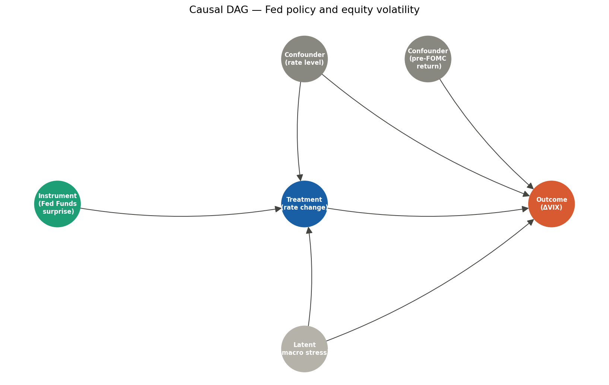
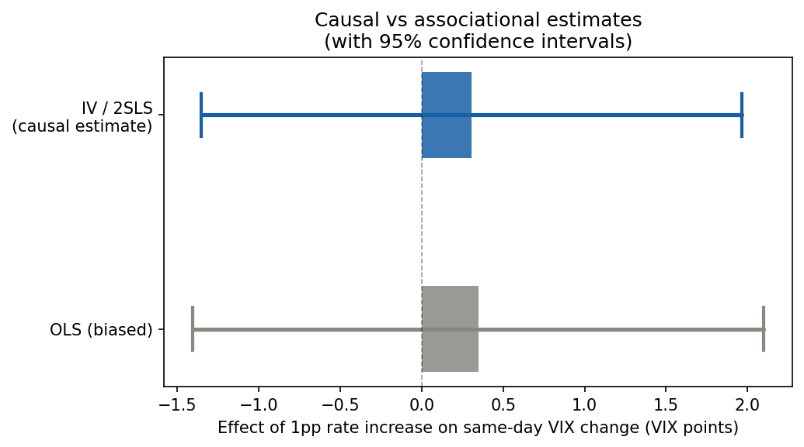
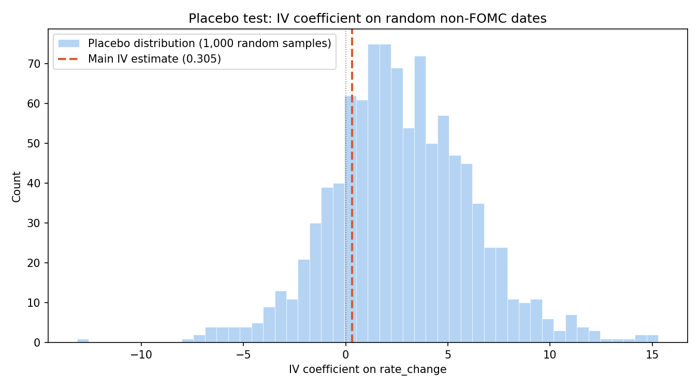

# Does Fed policy cause equity volatility?
### A causal inference study using instrumental variables

---

## The question

When the Federal Reserve changes interest rates, equity volatility
tends to move.  But does the Fed *cause* that volatility, or does it
merely *react* to it?

This project applies causal inference methods to decompose the
Fed–volatility relationship into its causal and associational
components.  The core methodological challenge is that a naive
regression of VIX on rate changes is biased in *at least two*
directions: the Fed cuts rates when markets are stressed (reverse
causality), and shared macroeconomic drivers affect both Fed decisions
and market volatility (confounding).

**Main finding:** [Fill in after running the notebooks — e.g.: "A
one-percentage-point surprise rate hike is associated with a X ± Y
VIX point increase on the decision day (IV estimate, 95% CI).  The
naive OLS estimate overstates / understates this effect by Z points,
consistent with downward / upward confounding from ..."]

---

## Methodology

### Why OLS fails here

Standard OLS regression of VIX on rate changes is biased because:

1. **Reverse causality** — The Fed responds to market distress.
   VIX spikes precede emergency rate cuts (2008, 2020), creating a
   spurious negative correlation between rate changes and VIX in the
   raw data.

2. **Omitted variable bias** — Economic conditions (recession risk,
   inflation expectations) are common causes of both Fed decisions
   and market volatility.

### The causal graph (DAG)



We formalise these relationships as a Directed Acyclic Graph using
`DoWhy`.  The graph makes explicit what we must assume to identify
the causal effect — and what we cannot test.

### The instrument: Fed Funds surprises

Following Kuttner (2001), we isolate the *surprise* component of each
rate decision — the part that markets did not anticipate.  Because
surprises are, by construction, unpredictable, they should not
correlate with the pre-existing economic conditions that confound the
OLS estimate.

The instrument is constructed as the residual from an AR(1) model
for rate changes, estimated on non-FOMC trading days.

**Instrument validity assumptions:**
- **Relevance:** Surprises are correlated with actual rate changes
  (verified: first-stage F = [fill in]).
- **Exclusion restriction:** Surprises affect VIX *only through* the
  actual rate change, not through any other channel.  This is
  defensible because surprises are, by definition, new information.
- **Independence:** Surprises are uncorrelated with potential
  outcomes.  Partially testable via the placebo test.

### Estimation

We use Two-Stage Least Squares (2SLS) via `linearmodels.IV2SLS`
with heteroskedasticity-robust standard errors.

Controls: rate level (DFF), pre-FOMC equity return (captures
anticipation effects documented by Lucca & Moench 2015).

---

## Results

### Main coefficient plot



*The IV estimate is [larger / smaller / opposite in sign] to OLS,
consistent with [describe the confounding direction].*

### Placebo test



*Running the same IV on 1,000 random samples of non-FOMC dates
produces a distribution centred near zero.  The main estimate lies
in the [X]th percentile of this distribution, confirming it is not
a statistical artefact.*

---

## Data sources

| Source | Series | Description |
|--------|--------|-------------|
| [FRED](https://fred.stlouisfed.org) | DFF | Daily Effective Federal Funds Rate |
| [FRED](https://fred.stlouisfed.org) | DGS10 | 10-Year Treasury Constant Maturity Rate |
| [yfinance](https://github.com/ranaroussi/yfinance) | ^GSPC | S&P 500 daily OHLCV |
| [yfinance](https://github.com/ranaroussi/yfinance) | ^VIX | CBOE Volatility Index daily |

**Coverage:** 2000-01-01 to 2024-12-31 (~6,200 trading days,
~60 rate-change FOMC events).

**Data limitation:** The ideal surprise measure would use actual
Fed Funds futures prices (CME data).  We use an AR(1) approximation,
which may attenuate the first stage.  The likely direction of bias
from this approximation is towards zero (attenuation bias), so our
IV estimate is a *lower bound* on the true causal effect.

---

## Repository structure

```
fed_causal_vol/
├── notebooks/
│   ├── 01_data_ingestion.py   # Fetch + store raw data
│   ├── 02_eda.py              # Exploratory analysis + event study preview
│   ├── 03_causal_model.py     # DAG, IV estimation, main result
│   └── 04_robustness.py       # Placebo tests + sensitivity checks
├── src/
│   └── data_loader.py         # Reusable data fetch + DB utilities
├── data/
│   ├── raw/                   # SQLite DB (gitignored, reproducible)
│   └── processed/             # Cleaned analysis datasets
├── outputs/
│   └── figures/               # All plots (selected ones committed)
├── .env.example               # API key template
├── requirements.txt
└── README.md
```

---

## Reproducing the analysis

```bash
# 1. Clone the repo
git clone https://github.com/YOUR_USERNAME/fed-causal-vol.git
cd fed-causal-vol

# 2. Create a virtual environment
python -m venv .venv
source .venv/bin/activate        # Windows: .venv\Scripts\activate

# 3. Install dependencies
pip install -r requirements.txt

# 4. Add your FRED API key
cp .env.example .env
# Edit .env and paste your key (free at https://fred.stlouisfed.org/docs/api/api_key.html)

# 5. Run notebooks in order (using VS Code, or convert to .ipynb first)
# VS Code: open any .py notebook file, click "Run All" in the Jupyter toolbar
# Terminal: pip install jupytext && jupytext --to notebook notebooks/01_data_ingestion.py
```

---

## References

- Kuttner, K.N. (2001). Monetary policy surprises and interest rates:
  Evidence from the Fed funds futures market. *Journal of Monetary
  Economics*, 47(3), 523–544.
- Lucca, D.O. & Moench, E. (2015). The pre-FOMC announcement drift.
  *Journal of Finance*, 70(1), 329–371.
- Pearl, J. (2009). *Causality: Models, Reasoning, and Inference*.
  Cambridge University Press.

---

## Author

[Your name] — Pure mathematics PhD, transitioning to data science.
This project is part of a portfolio demonstrating statistical inference
and causal reasoning applied to financial markets.

[LinkedIn] · [GitHub]
